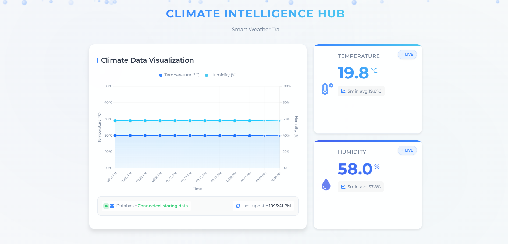

# EnviroSense

A real-time weather monitoring system that tracks temperature and humidity in your environment.



## Overview

This application collects temperature and humidity data through MQTT, stores it in a database, and shows it on a webpage with live updates.

## Features

- Live temperature and humidity monitoring
- Data storage in SQLite database
- Interactive charts
- Mobile-friendly design

## Getting Started

1. Make sure you have Node.js installed
2. Download the project files
3. Open terminal and run:
   ```sh
   npm install
   node server.js
   ```
4. Open your web browser and go to: [http://localhost:3000](http://localhost:3000)

## How to Use

- The main page shows current temperature and humidity
- Values update automatically when new data arrives
- Charts show historical data over time
- Database viewer available at `/db-viewer`

## Technical Requirements

- Node.js
- npm
- Web browser
- Internet connection

## Support

If you need help, please open an issue in the repository.

## Author

[Your Name]
